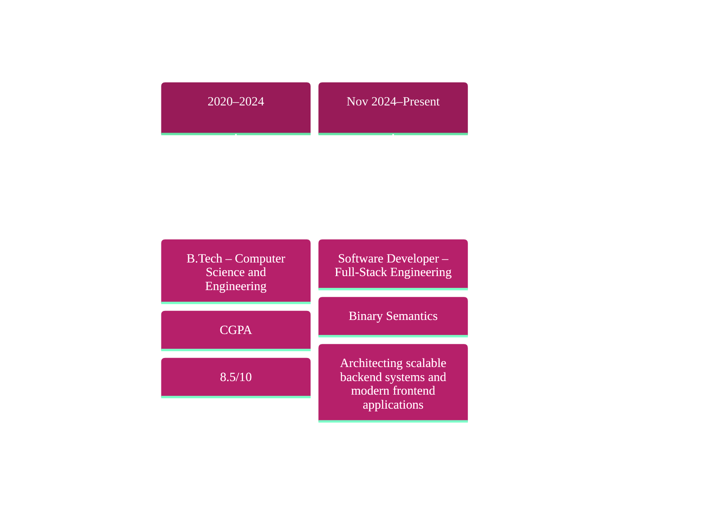

<!-- Header Typing Animation -->
<div align="center">
  <a href="https://git.io/typing-svg">
    
  </a>
</div>
<!-- Banner GIF -->
<p align="center">
  
</p>
<!-- Social Badges -->
<div align="center">
  <a href="https://www.linkedin.com/in/aryan-negi-3aaabb203/" target="_blank">
    
  </a>
  <a href="https://github.com/aryan21negi" target="_blank">
    
  </a>
   <a href="https://drive.google.com/file/d/1y73bBaBe0MDe_nMWBUyQu6yAMHZlwo4P/view?usp=sharing" target="_blank">
    
  </a>
  <a href="mailto:aryannegi2110@gmail.com">
    
  </a>
  <a href="tel:+918800580394">
    
  </a>
</div>
<!-- Divider -->

<!-- About Me Section -->


###  About Me

 
```yaml
  Aryan@DevBox
     /\_/\        ─────────────────────────────────────────
    ( o.o )       OS    : Software Development Engineer
     > ^ <        Host  : Binary Semantics, Gurugram
                  Edu   : B.Tech CSE, Galgotias University (CGPA: 8.5)
  ─────────────   Uptime: Nov 2024 — Present
  | ███ ███ █ |
  | ███ ███ █ |   ──────────────── TECH STACK ────────────────
  | ███ ███ █ |
  ─────────────   Languages : C#, JavaScript, TypeScript, Python, SQL
                  Frontend  : React.js, HTML5, CSS3, Bootstrap, Tailwind CSS
                  Backend   : ASP.NET Core, .NET MVC, Node.js
                  Databases : SQL Server, MongoDB, PostgreSQL
                  DevOps    : Docker, Azure DevOps, Git, GitHub
                  Tools     : VS Code, Visual Studio, Postman, SSMS, SoapUI, SonarQube

                  ─────────────── HIGHLIGHTS ──────────────────

                  Coursework : DSA · OOP · Computer Networks · OS · DBMS
                  Impact     : Improved claim processing efficiency by 40%
                  Perf       : Boosted query speed by 20% via lazy loading
                  Hackathon  : Top 10 / 50 teams — Dexterix 3.0
                  Research   : Published & presented paper at ICDAM 2024
                  Practice   : 300+ DSA problems on GFG, CodingNinjas & LeetCode
                  Sports     : Cricket captain — 1st runner-up, Intra-University
                  Theme      : Building scalable full-stack apps & backend perf
                  Shell      : Currently exploring [ Docker · Cloud · System Design ]
```
 
<!-- Tech Stack Section -->
##  Tech Stack & Tools

<p align="center">
  
  
  
  
  
  
  
</p>

<div align="center">

### Languages


### Frameworks & Libraries


### Databases & Tools


</div>

<!-- Divider -->


##  Featured Projects
 
<div align="center">
<table>
<tr>
<td width="50%">
<h3 align="center">🚀 Space Travel — Space Tour Website</h3>
<p align="center">
An interactive space tour site built with HTML, Tailwind CSS, JavaScript & React, letting users explore Earth from space — fully responsive, with optimized images and lazy-loaded media for faster page loads.
</p>
<p align="center">
<a href="https://space-travel-beige.vercel.app/" target="_blank">

</a>
<a href="https://github.com/aryan21negi/Space-Travel" target="_blank">

</a>
</p>
</td>
<td width="50%">
<h3 align="center">📰 News Authenticity Check using ML</h3>
<p align="center">
A fake news detection system using Logistic Regression, Decision Tree, Random Forest & Gradient Boosting, achieving 99.2% average accuracy across classifiers. Published & presented as a research paper at ICDAM 2024.
</p>
</td>
</tr>
<tr>
<td width="50%">
<h3 align="center">🏨 TravelHaven — Hotel Website</h3>
<p align="center">
An interactive, optimized hotel booking interface focused on clean UX.
</p>
<p align="center">
<a href="https://dreamstay-hotel-website.vercel.app" target="_blank">

</a>
<a href="https://github.com/aryan21negi/TravelHaven-Hotel-Website-Project" target="_blank">

</a>
</p>
</td>
<td width="50%">
<h3 align="center">📚 BrainBridge — E-Learning Website</h3>
<p align="center">
A learning platform built with intuitive, user-friendly navigation.
</p>
<p align="center">
<a href="https://brain-bridge-gamma.vercel.app/" target="_blank">

</a>
<a href="https://github.com/aryan21negi/BrainBridge" target="_blank">

</a>
</p>
</td>
</tr>
</table>
</div>


##  Compact Projects
 
<p align="center">
<a href="https://to-do-two-sand.vercel.app/" target="_blank"></a>
<a href="https://tic-tac-toe-rouge-five.vercel.app/" target="_blank"></a>
<a href="https://calculator-puce-omega.vercel.app" target="_blank"></a>
<a href="https://rock-paper-scissors-nu-ebon.vercel.app/" target="_blank"></a>
<a href="https://weather-app-ten-tau-45.vercel.app" target="_blank"></a>
</p>
<!-- Divider -->


## 💼 Work Experience




<!-- Divider -->


## 🏆 Achievements & Milestones
 
- 🥇 Top 10 among 50 teams in **Dexterix 3.0 Hackathon** (University-held)
- 💻 Solved **300+ DSA problems** on GeeksforGeeks, CodingNinjas & LeetCode
- 🏏 Captained the **Cricket team** in Intra University Tournament — 1st Runner Up
- 🏅 Multiple medals in **School Athletics**
- 📄 Published & presented research at **ICDAM 2024**
- 🔐 Completed a **Cybersecurity Virtual Internship** program
<!-- Divider -->


<div align="center">

### 💭 Random Dev Quote


 

<!-- Footer -->

<p align="center">
  
</p>
<div align="center">
  
</div>
<div align="center">

### ⚡ "Code is like humor. When you have to explain it, it's bad." – Cory House
 
**Show some ❤️ by starring ⭐ some of the repositories!**
 
</div>
